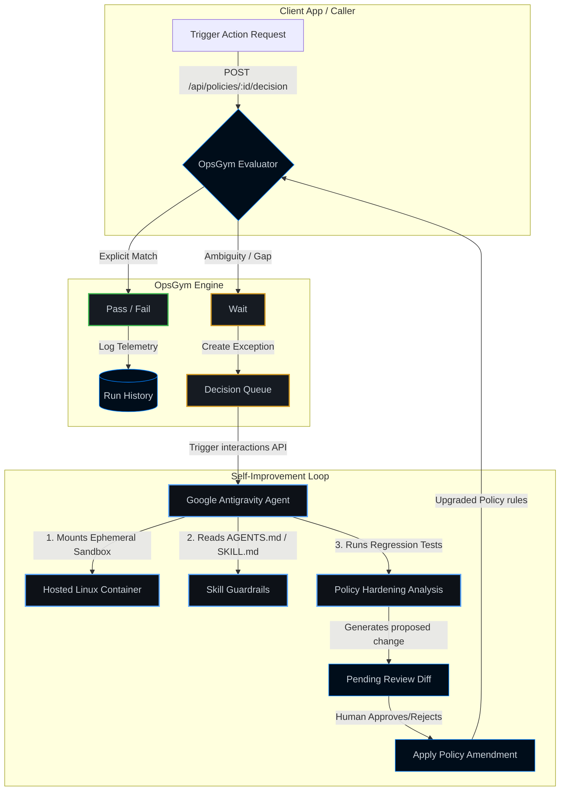

# OpsGym 🏋️‍♂️

### Self-Improving Policy Engine for Operational AI

**Live Demo:** [opsgym.pdt.dev](https://opsgym.pdt.dev)

---

## Introduction
Operational AI is volatile. When we delegate consequential decisions—like billing refunds, fraud checks, account suspensions, or SLA exceptions—to autonomous agents, we run into a major safety bottleneck: **the alignment problem**. 

If we give agents open-ended prompts, they hallucinate, drift, or make incorrect, un-auditable exceptions. If we lock them down with rigid scripts, they fail to handle real-world operational spillover. 

**OpsGym solves this by introducing a stable, self-improving decision layer.**

OpsGym decouples **judgment** (governed by natural-language policies and principles) from **execution** (the Slack bots, browser testers, or API workers performing the task). It acts as a policy gatekeeper, returning a deterministic `Pass`, `Fail`, or `Wait` decision.

When the system encounters a complex operational edge case, it does not guess. It triggers a `Wait` state, captures the context, and uses **Google's hosted Managed Agent (Antigravity)** to analyze the exception, evaluate regression test cases, and write a targeted, reviewer-safe policy amendment. 

The result is **auditable recursive intelligence**: the AI continuously optimizes the boundaries of its own judgment based on production usage, keeping humans securely in the loop.

---

## The Self-Learning Loop

This diagram illustrates how OpsGym handles live requests, logs telemetry, triggers the self-improvement agent when a policy boundary is unclear, and commits the reviewed changes back to the endpoint.

---

## The Tech Stack

OpsGym is built from the ground up for containerized, serverless, and agentic workflows:

*   **Core Framework:** [Next.js 15 (App Router)](https://nextjs.org/) & React 19, fully typed with TypeScript.
*   **Aesthetics:** High-density, minimalist flat-dark design built using Vanilla CSS for lightning-fast loads and zero bloating.
*   **Deployment:** Containerized via a multi-stage [Dockerfile](file:///Users/chris/Documents/GitHub/opsgym/Dockerfile) and deployed as a web service on the **DigitalOcean App Platform** ([.do/app.yaml](file:///Users/chris/Documents/GitHub/opsgym/.do/app.yaml)).
*   **AI Orchestration:**
    *   **Hosted Agent Runtime:** Leverages Google's **Managed Agents API (Interactions API)** running the `antigravity-preview-05-2026` agent.
    *   **Agent Configuration:** Configured using local [.agents/AGENTS.md](file:///Users/chris/Documents/GitHub/opsgym/.agents/AGENTS.md) rules and custom markdown skills.

---

## How to Demo the Self-Improvement Flow

1.  **Encounter an Exception:** Navigate to the **Refund Policy**. In the *Test Endpoint* input, execute an ambiguous request: *"Refund a VIP customer's damaged order from 45 days ago without manager approval."*
2.  **Inspect the Exception:** Because this violates standard limits (30 days) and lacks validation, the system returns a `Wait` status.
3.  **Review the Proposal:** Under the **Queue** tab, select the newly generated item. You will see a detailed diff proposed by the Antigravity agent:
    *   *Before:* Standard 30-day limits.
    *   *After:* Hardened clause allowing VIP exceptions up to 90 days *only if* manager approval is explicitly attached.
4.  **Approve and Harden:** Click **Approve**. The policy is immediately patched.
5.  **Verify Continual Learning:** Re-run the exact same VIP refund request. It now resolves to `Pass` (or `Fail` depending on presence of approval context) instantly, proving the loop has successfully closed.
